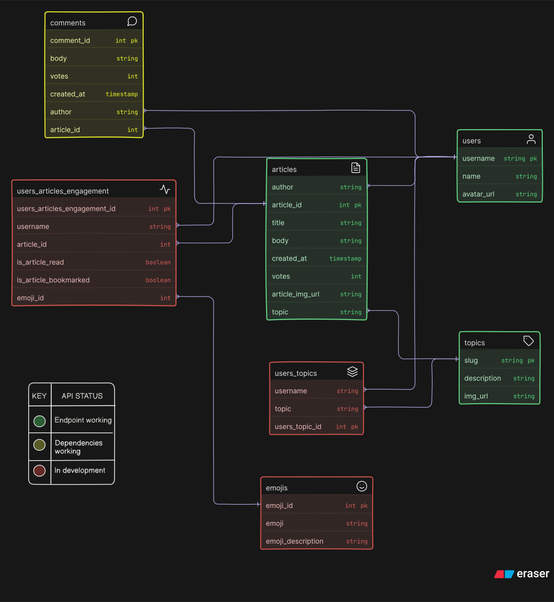

# News Aggregator setup

This repo contains all scripts and data necessary to serve an api of a mock-up of a basic news-based site where users can post, and interact with, articles.

The current live api server can be found at: https://news-aggregator-7e9t.onrender.com/

All APIs are currently unrestricted and accessible to all, and a list of endpoints will be published shortly, with information about what can be accessed, and how.

For a current test, please see the list of articles in the database at: https://news-aggregator-7e9t.onrender.com/api/articles

## Local hosting - Necessary repo modifications

The DB and api were developed with the following packages:
{
"express": "^5.1.0",
"dotenv": "^16.5.0",
"nodemon": "^3.1.10",
"pg": "^8.16.0",
"pg-format": "^1.0.4"
},

Run using the following engine:

{"node": ">=6.0.0}

To host the content locally will require creation of two environment variables:

1. '.env.development'
2. '.env.test'

These can either be automated by running `'npm run setup-env"` in the terminal, or created manually and populated as follows:

### .env.development

`PGDATABASE=nc_news`

### .env.test

`PGDATABASE=nc_news_test`

## Progress Status

As the repo is currently a work in progress, regular checks for commits and / or pull requests should be made before any major revisions to the codebase.

1. Debugging and testing - In progress
2. ERD Creation - In progress
3. Live API server - In progress

# ERD:

